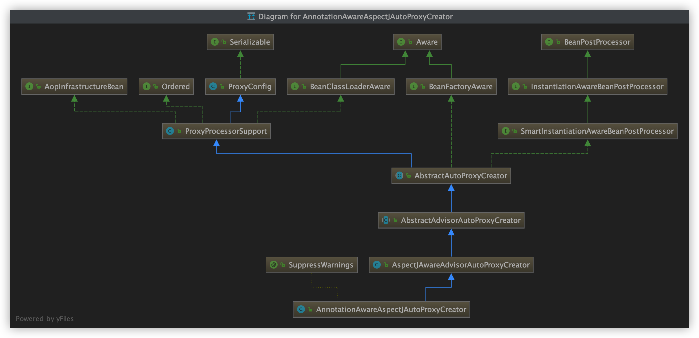

### AOP

启动类注解增加

#### @EnableAspectJAutoProxy解析

```java
boolean proxyTargetClass() default false;
```

判断使用什么代理


```java
@Import(AspectJAutoProxyRegistrar.class)
```

AspectJAutoProxyRegistrar实现了ImportBeanDefinitionRegistrar下的registerBeanDefinitions方法：


​    AopConfigUtils.registerAspectJAnnotationAutoProxyCreatorIfNecessary(registry);

​        registerOrEscalateApcAsRequired(AnnotationAwareAspectJAutoProxyCreator.class, registry, source);

​			registry.registerBeanDefinition(AUTO_PROXY_CREATOR_BEAN_NAME, beanDefinition);//注入到ioc

#### AnnotationAwareAspectJAutoProxyCreator.class

具体流程看同目录下pdf文件夹下**springAop核心组件分析**

AnnotationAwareAspectJAutoProxyCreator.class贯穿了aop功能



关注后置处理（bean初始化前后的事情），自动装配beanfactory


SmartInstantiationAwareBeanPostProcessor：bean的后置处理器

BeanFactoryAware：能把beanfactory传入


AnnotationAwareAspectJAutoProxyCreator.class创建：

org.springframework.context.support.AbstractApplicationContext#refresh

org.springframework.context.support.AbstractApplicationContext#registerBeanPostProcessors

org.springframework.context.support.AbstractApplicationContext#registerBeanPostProcessors

​	List<BeanPostProcessor> orderedPostProcessors = new ArrayList<>();

​	BeanPostProcessor pp = beanFactory.getBean(ppName, BeanPostProcessor.class);

​	接下来就是常规的ioc创建对象


​					


