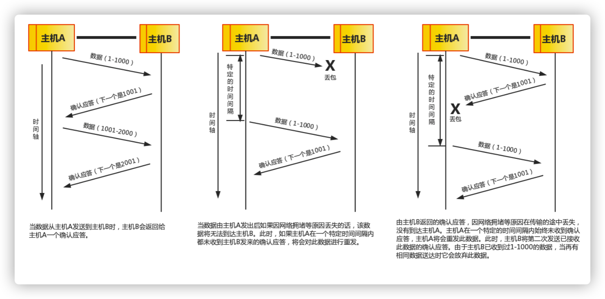

## 计算机网络结构

开放系统互连参考模型 (Open System Interconnect 简称OSI）是国际标准化组织(ISO)和国际电报电话咨询委员会(CCITT)联合制定的开放系统互连参考模型，为开放式互连信息系统提供了一种功能结构的框架。其目的是为异种计算机互连提供一个共同的基础和标准框架，并为保持相关标准的一致性和兼容性提供共同的参考。这里所说的开放系统，实质上指的是遵循OSI参考模型和相关协议能够实现互连的具有各种应用目的的计算机系统。

OSI采用了分层的结构化技术，共分七层，物理层、数据链路层、网络层、传输层、会话层、表示层、应用层。

## OSI七层模型各层的作用

物理层并不是物理媒体本身，它只是开放系统中利用物理媒体实现物理连接的功能描述和执行连接的规程。

物理层的媒体包括架空明线、平衡电缆、光纤、无线信道等。通信用的互连设备指DTE（Data Terminal Equipment）和DCE（Data Communications Equipment）间的互连设备。DTE即[数据终端设备](https://baike.baidu.com/item/数据终端设备)，又称[物理设备](https://baike.baidu.com/item/物理设备)，如计算机、终端等都包括在内。而DCE则是数据通信设备或电路连接设备，如[调制解调器](https://baike.baidu.com/item/调制解调器)等。数据传输通常是经过DTE-DCE，再经过DCE-DTE的路径。互连设备指将DTE、DCE连接起来的装置，如各种插头、插座。LAN中的各种粗、细同轴电缆、T型接头、插头、接收器、发送器、[中继器](https://baike.baidu.com/item/中继器)等都属物理层的媒体和连接器。

[物理层](https://baike.baidu.com/item/物理层)的主要功能是：

① 为数据端设备提供传送数据的通路，[数据通路](https://baike.baidu.com/item/数据通路)可以是一个[物理媒体](https://baike.baidu.com/item/物理媒体)，也可以是多个物理媒体连接而成。一次完整的数据传输，包括激活物理连接、传送数据和终止物理连接。所谓激活，就是不管有多少[物理媒体](https://baike.baidu.com/item/物理媒体)参与，都要在通信的两个[数据终端设备](https://baike.baidu.com/item/数据终端设备)间连接起来，形成一条通路。

② ②传输数据。[物理层](https://baike.baidu.com/item/物理层)要形成适合数据传输需要的实体，为数据传送服务。一是要保证数据能在其上正确通过，二是要提供足够的[带宽](https://baike.baidu.com/item/带宽)(带宽是指每秒钟内能通过的比特(Bit)数)，以减少信道上的拥塞。传输数据的方式能满足点到点，一点到多点，串行或并行，半双工或全双工，同步或[异步传输](https://baike.baidu.com/item/异步传输)的需要。

数据链路可以粗略地理解为数据通道。[物理层](https://baike.baidu.com/item/物理层)要为[终端设备](https://baike.baidu.com/item/终端设备)间的数据通信提供[传输介质](https://baike.baidu.com/item/传输介质)及其连接。介质是长期的，连接是有生存期的。在连接生存期内，收发两端可以进行不等的一次或多次数据通信。每次通信都要经过建立通信联络和拆除通信联络两个过程。这种建立起来的数据收发关系就叫做数据链路。而在[物理媒体](https://baike.baidu.com/item/物理媒体)上传输的数据难免受到各种不可靠因素的影响而产生差错，为了弥补[物理层](https://baike.baidu.com/item/物理层)上的不足，为上层提供无差错的数据传输，就要能对数据进行检错和纠错。[链路层](https://baike.baidu.com/item/链路层)应具备如下功能：

链路连接的建立、拆除和分离；

差错检测和恢复。还有链路标识，[流量控制](https://baike.baidu.com/item/流量控制)等等。

独立的链路产品中最常见的当属网卡，网桥也是链路产品。

网络层，当数据终端增多时。它们之间有中继设备相连，此时会出现一台[终端](https://baike.baidu.com/item/终端)要求不只是与惟一的一台而是能和多台终端通信的情况，这就产生了把任意两台[数据终端设备](https://baike.baidu.com/item/数据终端设备)的数据链接起来的问题，也就是[路由](https://baike.baidu.com/item/路由)或者叫寻径。另外，当一条物理信道建立之后，被一对用户使用，往往有许多空闲时间被浪费掉。人们自然会希望让多对用户共用一条链路，为解决这一问题就出现了逻辑信道技术和[虚拟电路](https://baike.baidu.com/item/虚拟电路)技术。

传输层有一个既存事实，即世界上各种[通信子网](https://baike.baidu.com/item/通信子网)在性能上存在着很大差异。例如电话交换网，分组交换网，公用数据交换网，局域网等[通信子网](https://baike.baidu.com/item/通信子网)都可互连，但它们提供的[吞吐量](https://baike.baidu.com/item/吞吐量)，[传输速率](https://baike.baidu.com/item/传输速率)，数据延迟通信费用各不相同。对于会话层来说，却要求有一性能恒定的界面。[传输层](https://baike.baidu.com/item/传输层)就承担了这一功能。

会话层会话单位的控制层，其主要功能是按照在应用进程之间约定的原则，按照正确的顺序收、发数据，进行各种形态的对话。会话层规定了会话服务用户间会话连接的建立和拆除规程以及数据传送规程。

会话层提供的服务是应用建立和维持会话，并能使会话获得同步。会话层使用[校验点](https://baike.baidu.com/item/校验点)可使通信会话在通信失效时从校验点继续恢复通信。这种能力对于传送大的文件极为重要。

表示层其主要功能是把应用层提供的信息变换为能够共同理解的形式，提供字符代码、数据格式、控制信息格式、加密等的统一表示。表示层的作用之一是为异种机通信提供一种公共语言，以便能进行互操作。这种类型的服务之所以需要，是因为不同的计算机体系结构使用的数据表示法不同。例如，IBM[主机](https://baike.baidu.com/item/主机)使用EBCDIC编码，而大部分PC机使用的是ASCII码。在这种情况下，便需要表示层来完成这种转换。

应用层向应用程序提供服务，这些服务按其向应用程序提供的特性分成组，并称为服务元素。有些可为多种应用程序共同使用，有些则为较少的一类应用程序使用。应用层是开放系统的最高层，是直接为应用进程提供服务的。其作用是在实现多个系统应用进程相互通信的同时，完成一系列业务处理所需的服务。

## TCP/IP

通俗而言：TCP负责发现传输的问题，一有问题就发出信号，要求重新传输，直到所有数据安全正确地传输到目的地。而IP是给因特网的每一台联网设备规定一个地址。

## TCP和UDP

### TCP

TCP是面向连接的通信协议，通过[三次握手](https://baike.baidu.com/item/三次握手)建立连接，通讯完成时要拆除连接，由于TCP是面向连接的所以只能用于端到端的通讯。

TCP提供的是一种可靠的[数据流](https://baike.baidu.com/item/数据流)服务，采用“带重传的肯定确认”技术来实现传输的可靠性。TCP还采用一种称为“滑动窗口”的方式进行流量控制，所谓窗口实际表示接收能力，用以限制发送方的发送速度。

如果IP数据包中有已经封好的TCP数据包，那么IP将把它们向‘上’传送到TCP层。TCP将包排序并进行错误检查，同时实现虚电路间的连接。TCP数据包中包括序号和确认，所以未按照顺序收到的包可以被排序，而损坏的包可以被重传。

TCP将它的信息送到更高层的应用程序，例如Telnet的服务程序和客户程序。应用程序轮流将信息送回TCP层，TCP层便将它们向下传送到IP层，设备驱动程序和物理介质，最后到接收方。

面向连接的服务（例如[Telnet](https://baike.baidu.com/item/Telnet)、[FTP](https://baike.baidu.com/item/FTP/13839)、[rlogin](https://baike.baidu.com/item/rlogin)、[X Windows](https://baike.baidu.com/item/X Windows)和[SMTP](https://baike.baidu.com/item/SMTP)）需要高度的可靠性，所以它们使用了TCP。DNS在某些情况下使用TCP（发送和接收[域名](https://baike.baidu.com/item/域名)数据库），但使用UDP传送有关单个主机的信息。

### UDP

[UDP](https://baike.baidu.com/item/UDP)是面向无连接的通讯协议，UDP数据包括目的端口号和源端口号信息，由于通讯不需要连接，所以可以实现广播发送。

[UDP](https://baike.baidu.com/item/UDP)通讯时不需要接收方确认，属于不可靠的传输，可能会出现丢包现象，实际应用中要求程序员编程验证。

[UDP](https://baike.baidu.com/item/UDP)与[TCP](https://baike.baidu.com/item/TCP/5779591)位于同一层，但它不管数据包的顺序、错误或重发。因此，UDP不被应用于那些使用虚电路的面向连接的服务，UDP主要用于那些面向查询---应答的服务，例如NFS。相对于FTP或Telnet，这些服务需要交换的信息量较小。使用UDP的服务包括NTP（网络时间协议）和DNS（DNS也使用TCP），包总量较少的通信（DNS、SNMP等）；2.视频、音频等多媒体通信（即时通信）；3.限定于 LAN 等特定网络中的应用通信；4.广播通信（广播、多播）。

常用QQ，就是一个以UDP为主，TCP为辅的通讯协议。

### TCP 和UDP 的优缺点

无法简单地、绝对地去做比较：TCP 用于在传输层有必要实现可靠传输的情况；而在一方面，UDP 主要用于那些对高速传输和实时性有较高要求的通信或广播通信。TCP 和 UDP 应该根据应用的目的按需使用。

### 端口

数据链路和 IP 中的地址，分别指的是 MAC 地址和 IP 地址。前者用来识别同一链路中不同的计算机，后者用来识别 TCP/IP 网络中互连的主机和路由器。在传输层也有这种类似于地址的概念，那就是端口号。端口号用来识别同一台计算机中进行通信的不同应用程序。因此，它也被称为程序地址。

一台计算机上同时可以运行多个程序。传输层协议正是利用这些端口号识别本机中正在进行通信的应用程序，并准确地将数据传输。

端口号的确定

· 标准既定的端口号：这种方法也叫静态方法。它是指每个应用程序都有其指定的端口号。但并不是说可以随意使用任何一个端口号。例如 HTTP、FTP、TELNET 等广为使用的应用协议中所使用的端口号就是固定的。这些端口号被称为知名端口号，分布在 0~1023 之间；除知名端口号之外，还有一些端口号被正式注册，它们分布在 1024~49151 之间，不过这些端口号可用于任何通信用途。

· 时序分配法：服务器有必要确定监听端口号，但是接受服务的客户端没必要确定端口号。在这种方法下，客户端应用程序完全可以不用自己设置端口号，而全权交给操作系统进行分配。动态分配的端口号范围在 49152~65535 之间。

 ### 三次握手

TCP 提供面向有连接的通信传输。面向有连接是指在数据通信开始之前先做好两端之间的准备工作。

所谓三次握手是指建立一个 TCP 连接时需要客户端和服务器端总共发送三个包以确认连接的建立。在socket编程中，这一过程由客户端执行connect来触发。

第一次握手：客户端将标志位SYN置为1，随机产生一个值seq=J，并将该数据包发送给服务器端，客户端进入SYN_SENT状态，等待服务器端确认。

第二次握手：服务器端收到数据包后由标志位SYN=1知道客户端请求建立连接，服务器端将标志位SYN和ACK都置为1，ack=J+1，随机产生一个值seq=K，并将该数据包发送给客户端以确认连接请求，服务器端进入SYN_RCVD状态。

第三次握手：客户端收到确认后，检查ack是否为J+1，ACK是否为1，如果正确则将标志位ACK置为1，ack=K+1，并将该数据包发送给服务器端，服务器端检查ack是否为K+1，ACK是否为1，如果正确则连接建立成功，客户端和服务器端进入ESTABLISHED状态，完成三次握手，随后客户端与服务器端之间可以开始传输数据了。

### 四次挥手

四次挥手即终止TCP连接，就是指断开一个TCP连接时，需要客户端和服务端总共发送4个包以确认连接的断开。在socket编程中，这一过程由客户端或服务端任一方执行close来触发。

由于TCP连接是全双工的，因此，每个方向都必须要单独进行关闭，这一原则是当一方完成数据发送任务后，发送一个FIN来终止这一方向的连接，收到一个FIN只是意味着这一方向上没有数据流动了，即不会再收到数据了，但是在这个TCP连接上仍然能够发送数据，直到这一方向也发送了FIN。首先进行关闭的一方将执行主动关闭，而另一方则执行被动关闭。

1. 客户端进程发出连接释放报文，并且停止发送数据。释放数据报文首部，FIN=1，其序列号为seq=u（等于前面已经传送过来的数据的最后一个字节的序号加1），此时，客户端进入FIN-WAIT-1（终止等待1）状态。 TCP规定，FIN报文段即使不携带数据，也要消耗一个序号。

2. 服务器收到连接释放报文，发出确认报文，ACK=1，ack=u+1，并且带上自己的序列号seq=v，此时，服务端就进入了CLOSE-WAIT（关闭等待）状态。TCP服务器通知高层的应用进程，客户端向服务器的方向就释放了，这时候处于半关闭状态，即客户端已经没有数据要发送了，但是服务器若发送数据，客户端依然要接受。这个状态还要持续一段时间，也就是整个CLOSE-WAIT状态持续的时间。

3. 客户端收到服务器的确认请求后，此时，客户端就进入FIN-WAIT-2（终止等待2）状态，等待服务器发送连接释放报文（在这之前还需要接受服务器发送的最后的数据）。

4. 服务器将最后的数据发送完毕后，就向客户端发送连接释放报文，FIN=1，ack=u+1，由于在半关闭状态，服务器很可能又发送了一些数据，假定此时的序列号为seq=w，此时，服务器就进入了LAST-ACK（最后确认）状态，等待客户端的确认。

5. 客户端收到服务器的连接释放报文后，必须发出确认，ACK=1，ack=w+1，而自己的序列号是seq=u+1，此时，客户端就进入了TIME-WAIT（时间等待）状态。注意此时TCP连接还没有释放，必须经过2∗∗MSL（最长报文段寿命）的时间后，当客户端撤销相应的TCB后，才进入CLOSED状态。

6. 服务器只要收到了客户端发出的确认，立即进入CLOSED状态。同样，撤销TCB后，就结束了这次的TCP连接。可以看到，服务器结束TCP连接的时间要比客户端早一些。

## TCP/IP中的数据包

每个分层中，都会对所发送的数据附加一个首部，在这个首部中包含了该层必要的信息，如发送的目标地址以及协议相关信息。通常，为协议提供的信息为包首部，所要发送的内容为数据。在下一层的角度看，从上一层收到的包全部都被认为是本层的数据。

网络中传输的数据包由两部分组成：一部分是协议所要用到的首部，另一部分是上一层传过来的数据。首部的结构由协议的具体规范详细定义。在数据包的首部，明确标明了协议应该如何读取数据。反过来说，看到首部，也就能够了解该协议必要的信息以及所要处理的数据。

· ① 应用程序处理
首先应用程序会进行编码处理，这些编码相当于 OSI 的表示层功能；
编码转化后，邮件不一定马上被发送出去，这种何时建立通信连接何时发送数据的管理功能，相当于 OSI 的会话层功能。 

· ② TCP 模块的处理
TCP 根据应用的指示，负责建立连接、发送数据以及断开连接。TCP 提供将应用层发来的数据顺利发送至对端的可靠传输。为了实现这一功能，需要在应用层数据的前端附加一个 TCP 首部。 

· ③ IP 模块的处理
IP 将 TCP 传过来的 TCP 首部和 TCP 数据合起来当做自己的数据，并在 TCP 首部的前端加上自己的 IP 首部。IP 包生成后，参考路由控制表决定接受此 IP 包的路由或主机。 

· ④ 网络接口（以太网驱动）的处理
从 IP 传过来的 IP 包对于以太网来说就是数据。给这些数据附加上以太网首部并进行发送处理，生成的以太网数据包将通过物理层传输给接收端。 

· ⑤ 网络接口（以太网驱动）的处理
主机收到以太网包后，首先从以太网包首部找到 MAC 地址判断是否为发送给自己的包，若不是则丢弃数据。
如果是发送给自己的包，则从以太网包首部中的类型确定数据类型，再传给相应的模块，如 IP、ARP 等。这里的例子则是 IP 。 

· ⑥ IP 模块的处理
IP 模块接收到 数据后也做类似的处理。从包首部中判断此 IP 地址是否与自己的 IP 地址匹配，如果匹配则根据首部的协议类型将数据发送给对应的模块，如 TCP、UDP。这里的例子则是 TCP。
另外吗，对于有路由器的情况，接收端地址往往不是自己的地址，此时，需要借助路由控制表，在调查应该送往的主机或路由器之后再进行转发数据。 

· ⑦ TCP 模块的处理
在 TCP 模块中，首先会计算一下校验和，判断数据是否被破坏。然后检查是否在按照序号接收数据。最后检查端口号，确定具体的应用程序。数据被完整地接收以后，会传给由端口号识别的应用程序。 

· ⑧ 应用程序的处理
接收端应用程序会直接接收发送端发送的数据。通过解析数据，展示相应的内容。

## TCP 中通过序列号与确认应答提高可靠性

在 TCP 中，当发送端的数据到达接收主机时，接收端主机会返回一个已收到消息的通知。这个消息叫做确认应答（ACK）。当发送端将数据发出之后会等待对端的确认应答。如果有确认应答，说明数据已经成功到达对端。反之，则数据丢失的可能性很大。

在一定时间内没有等待到确认应答，发送端就可以认为数据已经丢失，并进行重发。由此，即使产生了丢包，仍然能够保证数据能够到达对端，实现可靠传输。

未收到确认应答并不意味着数据一定丢失。也有可能是数据对方已经收到，只是返回的确认应答在途中丢失。这种情况也会导致发送端误以为数据没有到达目的地而重发数据。

此外，也有可能因为一些其他原因导致确认应答延迟到达，在源主机重发数据以后才到达的情况也屡见不鲜。此时，源主机只要按照机制重发数据即可。

对于目标主机来说，反复收到相同的数据是不可取的。为了对上层应用提供可靠的传输，目标主机必须放弃重复的数据包。为此我们引入了序列号。

序列号是按照顺序给发送数据的每一个字节（8位字节）都标上号码的编号。接收端查询接收数据 TCP 首部中的序列号和数据的长度，将自己下一步应该接收的序列号作为确认应答返送回去。通过序列号和确认应答号，TCP 能够识别是否已经接收数据，又能够判断是否需要接收，从而实现可靠传输。

## HTTP请求的传输过程

首先作为发送端的客户端在应用层（HTTP 协议）发出一个想看某个 Web 页面的 HTTP 请求。

接着，为了传输方便，在传输层（TCP 协议）把从应用层处收到的数据（HTTP 请求报文）进行分割，并在各个报文上打上标记序号及端口号后转发给网络层。

在网络层（IP 协议），增加作为通信目的地的 MAC 地址后转发给链路层。这样一来，发往网络的通信请求就准备齐全了。

接收端的服务器在链路层接收到数据，按序往上层发送，一直到应用层。当传输到应用层，才能算真正接收到由客户端发送过来的 HTTP请求。

## 一次完整http请求的7个过程

· 建立 TCP 连接
在HTTP工作开始之前，客户端首先要通过网络与服务器建立连接，该连接是通过 TCP 来完成的，该协议与 IP 协议共同构建 Internet，即著名的 TCP/IP 协议族，因此 Internet 又被称作是 TCP/IP 网络。HTTP 是比 TCP 更高层次的应用层协议，根据规则，只有低层协议建立之后，才能进行高层协议的连接，因此，首先要建立 TCP 连接，一般 TCP 连接的端口号是80； 

· 客户端向服务器发送请求命令
一旦建立了TCP连接，客户端就会向服务器发送请求命令；
例如：GET/sample/hello.jsp HTTP/1.1 

· 客户端发送请求头信息
客户端发送其请求命令之后，还要以头信息的形式向服务器发送一些别的信息，之后客户端发送了一空白行来通知服务器，它已经结束了该头信息的发送； 

· 服务器应答
客户端向服务器发出请求后，服务器会客户端返回响应；
例如： HTTP/1.1 200 OK
响应的第一部分是协议的版本号和响应状态码 

· 服务器返回响应头信息
正如客户端会随同请求发送关于自身的信息一样，服务器也会随同响应向用户发送关于它自己的数据及被请求的文档； 

· 服务器向客户端发送数据
服务器向客户端发送头信息后，它会发送一个空白行来表示头信息的发送到此为结束，接着，它就以 Content-Type 响应头信息所描述的格式发送用户所请求的实际数据； 

· 服务器关闭 TCP 连接
一般情况下，一旦服务器向客户端返回了请求数据，它就要关闭 TCP 连接，然后如果客户端或者服务器在其头信息加入了这行代码 Connection:keep-alive ，TCP 连接在发送后将仍然保持打开状态，于是，客户端可以继续通过相同的连接发送请求。保持连接节省了为每个请求建立新连接所需的时间，还节约了网络带宽。

## HTTP 协议报文结构

用于 HTTP 协议交互的信息被称为 HTTP 报文。请求端（客户端）的 HTTP 报文叫做请求报文；响应端（服务器端）的叫做响应报文。HTTP 报文本身是由多行（用 CR+LF 作换行符）数据构成的字符串文本。

HTTP 报文大致可分为报文首部和报文主体两部分。两者由最初出现的空行（CR+LF）来划分。通常，并不一定有报文主体。

## 请求报文结构

请求报文的首部内容由以下数据组成：

请求行 —— 包含用于请求的方法、请求 URI 和 HTTP 版本。

首部字段 —— 包含表示请求的各种条件和属性的各类首部。（通用首部、请求首部、实体首部以及RFC里未定义的首部如 Cookie 等）

## 响应报文结构

状态行 —— 包含表明响应结果的状态码、原因短语和 HTTP 版本。

首部字段 —— 包含表示请求的各种条件和属性的各类首部。（通用首部、响应首部、实体首部以及RFC里未定义的首部如 Cookie 等）

## 一些常见术语

Socket是应用层与TCP/IP协议族通信的中间软件抽象层，它是一组接口。在设计模式中，Socket其实就是一个门面模式，它把复杂的TCP/IP协议族隐藏在Socket接口后面，对用户来说，一组简单的接口就是全部，让Socket去组织数据，以符合指定的协议。

主机 A 的应用程序要能和主机 B 的应用程序通信，必须通过 Socket 建立连接，而建立 Socket 连接必须需要底层TCP/IP 协议来建立 TCP 连接。建立 TCP 连接需要底层 IP 协议来寻址网络中的主机。我们知道网络层使用的 IP 协议可以帮助我们根据 IP 地址来找到目标主机，但是一台主机上可能运行着多个应用程序，如何才能与指定的应用程序通信就要通过 TCP 或 UPD 的地址也就是端口号来指定。这样就可以通过一个 Socket 实例唯一代表一个主机上的一个应用程序的通信链路了。

### 短连接：

连接->传输数据->关闭连接
  HTTP是无状态的，浏览器和服务器每进行一次HTTP操作，就建立一次连接，但任务结束就中断连接。
  也可以这样说：短连接是指SOCKET连接后发送后接收完数据后马上断开连接。

 ### 长连接：

连接->传输数据->保持连接 -> 传输数据-> 。。。 ->关闭连接。
  长连接指建立SOCKET连接后不管是否使用都保持连接，但安全性较差。

### 什么时候用长连接，短连接？

  长连接多用于操作频繁，点对点的通讯，而且连接数不能太多情况，。每个TCP连接都需要三步握手，这需要时间，如果每个操作都是先连接，再操作的话那么处理速度会降低很多，所以每个操作完后都不断开，次处理时直接发送数据包就OK了，不用建立TCP连接。例如：数据库的连接用长连接， 如果用短连接频繁的通信会造成socket错误，而且频繁的socket 创建也是对资源的浪费。

 而像WEB网站的http服务一般都用短链接，因为长连接对于服务端来说会耗费一定的资源，而像WEB网站这么频繁的成千上万甚至上亿客户端的连接用短连接会更省一些资源，如果用长连接，而且同时有成千上万的用户，如果每个用户都占用一个连接的话，那可想而知吧。所以并发量大，但每个用户无需频繁操作情况下需用短连好。

 总之，长连接和短连接的选择要视情况而定。

## Linux网络IO模型

### 同步和异步，阻塞和非阻塞

#### 同步和异步关注的是结果消息的通信机制

同步:同步的意思就是调用方需要主动等待结果的返回

异步:异步的意思就是不需要主动等待结果的返回，而是通过其他手段比如，状态通知，回调函数等。

#### 阻塞和非阻塞主要关注的是等待结果返回调用方的状态

阻塞:是指结果返回之前，当前线程被挂起，不做任何事

非阻塞:是指结果在返回之前，线程可以做一些其他事，不会被挂起。

### 1.同步阻塞:

同步阻塞基本也是编程中最常见的模型，打个比方你去商店买衣服，你去了之后发现衣服卖完了，那你就在店里面一直等，期间不做任何事(包括看手机)，等着商家进货，直到有货为止，这个效率很低。

### 2.同步非阻塞:
同步非阻塞在编程中可以抽象为一个轮询模式，你去了商店之后，发现衣服卖完了，这个时候不需要傻傻的等着，你可以去其他地方比如奶茶店，买杯水，但是你还是需要时不时的去商店问老板新衣服到了吗。

### 3.异步阻塞:
异步阻塞这个编程里面用的较少，有点类似你写了个线程池,submit然后马上future.get()，这样线程其实还是挂起的。有点像你去商店买衣服，这个时候发现衣服没有了，这个时候你就给老板留给电话，说衣服到了就给我打电话，然后你就守着这个电话，一直等着他响什么事也不做。这样感觉的确有点傻，所以这个模式用得比较少。

### 4.异步非阻塞:
好比你去商店买衣服，衣服没了，你只需要给老板说这是我的电话，衣服到了就打。然后你就随心所欲的去玩，也不用操心衣服什么时候到，衣服一到，电话一响就可以去买衣服了。

#### 阻塞I/O模型：

​       应用程序调用一个IO函数，导致应用程序阻塞，等待数据准备好。 如果数据没有准备好，一直等待….数据准备好了，从内核拷贝到用户空间,IO函数返回成功指示。

 当调用recv()函数时，系统首先查是否有准备好的数据。如果数据没有准备好，那么系统就处于等待状态。当数据准备好后，将数据从系统缓冲区复制到用户空间，然后该函数返回。在套接应用程序中，当调用recv()函数时，未必用户空间就已经存在数据，那么此时recv()函数就会处于等待状态。

#### 非阻塞IO模型 

​    我们把一个SOCKET接口设置为非阻塞就是告诉内核，当所请求的I/O操作无法完成时，不要将进程睡眠，而是返回一个错误。这样我们的I/O操作函数将不断的测试数据是否已经准备好，如果没有准备好，继续测试，直到数据准备好为止。在这个不断测试的过程中，会大量的占用CPU的时间。上述模型绝不被推荐。

  把SOCKET设置为非阻塞模式，即通知系统内核：在调用Windows Sockets API时，不要让线程睡眠，而应该让函数立即返回。在返回时，该函数返回一个错误代码。图所示，一个非阻塞模式套接字多次调用recv()函数的过程。前三次调用recv()函数时，内核数据还没有准备好。因此，该函数立即返回WSAEWOULDBLOCK错误代码。第四次调用recv()函数时，数据已经准备好，被复制到应用程序的缓冲区中，recv()函数返回成功指示，应用程序开始处理数据。

#### IO复用模型：

​       简介：主要是select和epoll；对一个IO端口，两次调用，两次返回，比阻塞IO并没有什么优越性；关键是能实现同时对多个IO端口进行监听；

​    I/O复用模型会用到select、poll、epoll函数，这几个函数也会使进程阻塞，但是和阻塞I/O所不同的的，这两个函数可以同时阻塞多个I/O操作。而且可以同时对多个读操作，多个写操作的I/O函数进行检测，直到有数据可读或可写时，才真正调用I/O操作函数。

当用户进程调用了select，那么整个进程会被block；而同时，kernel会“监视”所有select负责的socket；当任何一个socket中的数据准备好了，select就会返回。这个时候，用户进程再调用read操作，将数据从kernel拷贝到用户进程。
  这个图和blocking IO的图其实并没有太大的不同，事实上还更差一些。因为这里需要使用两个系统调用(select和recvfrom)，而blocking IO只调用了一个系统调用(recvfrom)。但是，用select的优势在于它可以同时处理多个connection。（select/epoll的优势并不是对于单个连接能处理得更快，而是在于能处理更多的连接。）

#### 信号驱动IO

   简介：两次调用，两次返回；

  首先我们允许套接口进行信号驱动I/O,并安装一个信号处理函数，进程继续运行并不阻塞。当数据准备好时，进程会收到一个SIGIO信号，可以在信号处理函数中调用I/O操作函数处理数据。

#### 异步IO模型

​    当一个异步过程调用发出后，调用者不能立刻得到结果。实际处理这个调用的部件在完成后，通过状态、通知和回调来通知调用者的输入输出操作

## 5个I/O模型的比较

### select、poll、epoll的区别？：

 1、支持一个进程所能打开的最大连接数

| select | 单个进程所能打开的最大连接数有FD_SETSIZE宏定义，其大小是32个整数的大小（在32位的机器上，大小就是32*32，同理64位机器上FD_SETSIZE为32*64），可以对进行修改，然后重新编译内核，但是性能可能会受到影响。 |
| ------ | ------------------------------------------------------------ |
| poll   | poll本质上和select没有区别，但是它没有最大连接数的限制，原因是它是基于链表来存储的 |
| epoll  | 连接数有上限，但是很大，1G内存的机器上可以打开10万左右的连接，2G内存的机器可以打开20万左右的连接 |

2、FD剧增后带来的IO效率问题

| select | 因为每次调用时都会对连接进行线性遍历，所以随着FD的增加会造成遍历速度慢的“线性下降性能问题”。 |
| ------ | ------------------------------------------------------------ |
| poll   | 同上                                                         |
| epoll  | 因为epoll内核中实现是根据每个fd上的callback函数来实现的，只有活跃的socket才会主动调用callback，所以在活跃socket较少的情况下，使用epoll没有前面两者的线性下降的性能问题，但是所有socket都很活跃的情况下，可能会有性能问题。 |

3、 消息传递方式

| select | 内核需要将消息传递到用户空间，都需要内核拷贝动作 |
| ------ | ------------------------------------------------ |
| poll   | 同上                                             |
| epoll  | epoll通过内核和用户空间共享一块内存来实现的。    |

### 补充知识 

#### Level_triggered(水平触发)：

当被监控的文件描述符上有可读写事件发生时，epoll_wait()会通知处理程序去读写。如果这次没有把数据一次性全部读写完(如读写缓冲区太小)，那么下次调用 epoll_wait()时，它还会通知你在上没读写完的文件描述符上继续读写，当然如果你一直不去读写，它会一直通知你！！！如果系统中有大量你不需要读写的就绪文件描述符，而它们每次都会返回，这样会大大降低处理程序检索自己关心的就绪文件描述符的效率！！！

#### Edge_triggered(边缘触发)：

当被监控的文件描述符上有可读写事件发生时，epoll_wait()会通知处理程序去读写。如果这次没有把数据全部读写完(如读写缓冲区太小)，那么下次调用epoll_wait()时，它不会通知你，也就是它只会通知你一次，直到该文件描述符上出现第二次可读写事件才会通知你！！！这种模式比水平触发效率高，系统不会充斥大量你不关心的就绪文件描述符！！

 select(),poll()模型都是水平触发模式，信号驱动IO是边缘触发模式，epoll()模型即支持水平触发，也支持边缘触发，默认是水平触发。

# 网络编程里通用常识

既然是通信，那么是肯定是有两个对端的。在通信编程里提供服务的叫服务端，连接服务端使用服务的叫客户端。在开发过程中，如果类的名字有Server或者ServerSocket的，表示这个类是给服务端用的，如果类的名字只有Socket的，那么表示这是负责具体的网络读写的。那么对于服务端来说ServerSocket就只是个场所，具体和客户端沟通的还是一个一个的socket，所以在通信编程里，ServerSocket并不负责具体的网络读写，ServerSocket就只是负责接收客户端连接后，新启一个socket来和客户端进行沟通。这一点对所有模式的通信编程都是适用的。

在通信编程里，我们关注的其实也就是三个事情：连接（客户端连接服务器，服务器等待和接收连接）、读网络数据、写网络数据，所有模式的通信编程都是围绕着这三件事情进行的。

# 原生JDK网络编程BIO 

服务端提供IP和监听端口，客户端通过连接操作想服务端监听的地址发起连接请求，通过三次握手连接，如果连接成功建立，双方就可以通过套接字进行通信。

  传统的同步阻塞模型开发中，ServerSocket负责绑定IP地址，启动监听端口；Socket负责发起连接操作。连接成功后，双方通过输入和输出流进行同步阻塞式通信。 

 采用BIO通信模型的服务端，通常由一个独立的Acceptor线程负责监听客户端的连接，它接收到客户端连接请求之后为每个客户端创建一个新的线程进行处理，通过输出流返回应答给客户端，线程销毁。即典型的一请求一应答模型。

该模型最大的问题就是缺乏弹性伸缩能力，当客户端并发访问量增加后，服务端的线程个数和客户端并发访问数呈1:1的正比关系，Java中的线程也是比较宝贵的系统资源，线程数量快速膨胀后，系统的性能将急剧下降，随着访问量的继续增大，系统最终就死-掉-了。

为了改进这种一连接一线程的模型，我们可以使用线程池来管理这些线程，实现1个或多个线程处理N个客户端的模型（但是底层还是使用的同步阻塞I/O），通常被称为“伪异步I/O模型“。

我们知道，如果使用CachedThreadPool线程池，其实除了能自动帮我们管理线程（复用），看起来也就像是1:1的客户端：线程数模型，而使用FixedThreadPool我们就有效的控制了线程的最大数量，保证了系统有限的资源的控制，实现了N:M的伪异步I/O模型。

  但是，正因为限制了线程数量，如果发生读取数据较慢时（比如数据量大、网络传输慢等），大量并发的情况下，其他接入的消息，只能一直等待，这就是最大的弊端。

# 原生JDK网络编程- AIO 

java从jdk1.7开始支持AIO核心类有AsynchronousSocketChannel 、AsynchronousServerSocketChannel。

java AIO为TCP通信提供的异步Channel AsynchronousServerSocketChannel创建成功后，类似于ServerSocket，也是调用accept()方法来接受来自客户端的连接，由于异步IO实际的IO操作是交给操作系统来做的，用户进程只负责通知操作系统进行IO和接受操作系统IO完成的通知。所以异步的ServerChannel调用accept()方法后，当前线程不会阻塞，程序也不知道accept()方法什么时候能够接收到客户端请求并且操作系统完成网络IO，为解决这个问题，AIO中accept方法是这样的：

<A> void accept(A attachment ,CompletionHandler<AsynchronousSocketChannel,? super A> handler)：开始接受来自客户端请求，连接成功或失败都会触发CompletionHandler对象的相应方法。

其中AsynchronousSocketChannel就代表该CompletionHandler处理器在处理连接成功时的result，就是一个AsynchronousSocketChannel的实例。? super A代表这个io操作上附加的数据的类型。

而CompletionHandler接口中定义了两个方法，

　completed(V result , A attachment)：当IO完成时触发该方法，该方法的第一个参数代表IO操作返回的对象，第二个参数代表发起IO操作时传入的附加参数。

　faild(Throwable exc, A attachment)：当IO失败时触发该方法，第一个参数代表IO操作失败引发的异常或错误。

AsynchronousSocketChannel的的用法与Socket类似，有三个方法：

　connect():用于连接到指定端口，指定IP地址的服务器

　read()、write():完成读写。 

 

 

# 原生JDK网络编程- NIO之Reactor模式 

“反应”器名字中”反应“的由来：

“反应”即“倒置”，“控制逆转”,具体事件处理程序不调用反应器，而向反应器注册一个事件处理器，表示自己对某些事件感兴趣，有时间来了，具体事件处理程序通过事件处理器对某个指定的事件发生做出反应；这种控制逆转又称为“好莱坞法则”（不要调用我，让我来调用你）

比如：

james老师去大保健，前台的接待小姐接待了james老师，james老师现在只对10000技师感兴趣，就告诉接待小姐，等10000技师上班了或者是空闲了，通知我。

等james接到通知了，做出了反应，把10000技师占住了，然后，james老师想起上一次的那个10000号房间不错，设备舒适，灯光暧昧，又告诉前台的接待小姐，我对10000号房间很感兴趣，房间空出来了就告诉我，我现在先和10000这个小姐聊下人生。

10000号房间空出来了，james接到通知了，james老师可以做出反应了。

james老师就是具体事件处理程序，前台的接待小姐就是所谓的反应器，10000技师和10000号房间空闲了就是事件，james老师只对这两个事件感兴趣，其他事件，比如10001号技师或者10000号房间空闲了也是事件，但是james老师不感兴趣。

## 单线程Reactor模式流程：

o 服务器端的Reactor是一个线程对象，该线程会启动事件循环，并使用Selector(选择器)来实现IO的多路复用。注册一个Acceptor事件处理器到Reactor中，Acceptor事件处理器所关注的事件是ACCEPT事件，这样Reactor会监听客户端向服务器端发起的连接请求事件(ACCEPT事件)。

② 客户端向服务器端发起一个连接请求，Reactor监听到了该ACCEPT事件的发生并将该ACCEPT事件派发给相应的Acceptor处理器来进行处理。Acceptor处理器通过accept()方法得到与这个客户端对应的连接(SocketChannel)，然后将该连接所关注的READ事件以及对应的READ事件处理器注册到Reactor中，这样一来Reactor就会监听该连接的READ事件了。

③ 当Reactor监听到有读或者写事件发生时，将相关的事件派发给对应的处理器进行处理。比如，读处理器会通过SocketChannel的read()方法读取数据，此时read()操作可以直接读取到数据，而不会堵塞与等待可读的数据到来。

④ 每当处理完所有就绪的感兴趣的I/O事件后，Reactor线程会再次执行select()阻塞等待新的事件就绪并将其分派给对应处理器进行处理。

注意，Reactor的单线程模式的单线程主要是针对于I/O操作而言，也就是所有的I/O的accept()、read()、write()以及connect()操作都在一个线程上完成的。

但在目前的单线程Reactor模式中，不仅I/O操作在该Reactor线程上，连非I/O的业务操作也在该线程上进行处理了，这可能会大大延迟I/O请求的响应。所以我们应该将非I/O的业务逻辑操作从Reactor线程上卸载，以此来加速Reactor线程对I/O请求的响应。

## 单线程Reactor，工作者线程池

与单线程Reactor模式不同的是，添加了一个工作者线程池，并将非I/O操作从Reactor线程中移出转交给工作者线程池来执行。这样能够提高Reactor线程的I/O响应，不至于因为一些耗时的业务逻辑而延迟对后面I/O请求的处理。

使用线程池的优势：

① 通过重用现有的线程而不是创建新线程，可以在处理多个请求时分摊在线程创建和销毁过程产生的巨大开销。

② 另一个额外的好处是，当请求到达时，工作线程通常已经存在，因此不会由于等待创建线程而延迟任务的执行，从而提高了响应性。

③ 通过适当调整线程池的大小，可以创建足够多的线程以便使处理器保持忙碌状态。同时还可以防止过多线程相互竞争资源而使应用程序耗尽内存或失败。

改进的版本中，所以的I/O操作依旧由一个Reactor来完成，包括I/O的accept()、read()、write()以及connect()操作。

对于一些小容量应用场景，可以使用单线程模型。但是对于高负载、大并发或大数据量的应用场景却不合适，主要原因如下：

① 一个NIO线程同时处理成百上千的链路，性能上无法支撑，即便NIO线程的CPU负荷达到100%，也无法满足海量消息的读取和发送；

② 当NIO线程负载过重之后，处理速度将变慢，这会导致大量客户端连接超时，超时之后往往会进行重发，这更加重了NIO线程的负载，最终会导致大量消息积压和处理超时，成为系统的性能瓶颈；

## 多Reactor线程模式

Reactor线程池中的每一Reactor线程都会有自己的Selector、线程和分发的事件循环逻辑。

mainReactor可以只有一个，但subReactor一般会有多个。mainReactor线程主要负责接收客户端的连接请求，然后将接收到的SocketChannel传递给subReactor，由subReactor来完成和客户端的通信。

流程：

① 注册一个Acceptor事件处理器到mainReactor中，Acceptor事件处理器所关注的事件是ACCEPT事件，这样mainReactor会监听客户端向服务器端发起的连接请求事件(ACCEPT事件)。启动mainReactor的事件循环。

② 客户端向服务器端发起一个连接请求，mainReactor监听到了该ACCEPT事件并将该ACCEPT事件派发给Acceptor处理器来进行处理。Acceptor处理器通过accept()方法得到与这个客户端对应的连接(SocketChannel)，然后将这个SocketChannel传递给subReactor线程池。

③ subReactor线程池分配一个subReactor线程给这个SocketChannel，即，将SocketChannel关注的READ事件以及对应的READ事件处理器注册到subReactor线程中。当然你也注册WRITE事件以及WRITE事件处理器到subReactor线程中以完成I/O写操作。Reactor线程池中的每一Reactor线程都会有自己的Selector、线程和分发的循环逻辑。

④ 当有I/O事件就绪时，相关的subReactor就将事件派发给响应的处理器处理。注意，这里subReactor线程只负责完成I/O的read()操作，在读取到数据后将业务逻辑的处理放入到线程池中完成，若完成业务逻辑后需要返回数据给客户端，则相关的I/O的write操作还是会被提交回subReactor线程来完成。

注意，所以的I/O操作(包括，I/O的accept()、read()、write()以及connect()操作)依旧还是在Reactor线程(mainReactor线程 或 subReactor线程)中完成的。Thread Pool(线程池)仅用来处理非I/O操作的逻辑。

多Reactor线程模式将“接受客户端的连接请求”和“与该客户端的通信”分在了两个Reactor线程来完成。mainReactor完成接收客户端连接请求的操作，它不负责与客户端的通信，而是将建立好的连接转交给subReactor线程来完成与客户端的通信，这样一来就不会因为read()数据量太大而导致后面的客户端连接请求得不到即时处理的情况。并且多Reactor线程模式在海量的客户端并发请求的情况下，还可以通过实现subReactor线程池来将海量的连接分发给多个subReactor线程，在多核的操作系统中这能大大提升应用的负载和吞吐量。

Netty服务端使用了“多Reactor线程模式”

## 和观察者模式的区别

观察者模式：
　　也可以称为为 发布-订阅 模式，主要适用于多个对象依赖某一个对象的状态并，当某对象状态发生改变时，要通知其他依赖对象做出更新。是一种一对多的关系。当然，如果依赖的对象只有一个时，也是一种特殊的一对一关系。通常，观察者模式适用于消息事件处理，监听者监听到事件时通知事件处理者对事件进行处理（这一点上面有点像是回调，容易与反应器模式和前摄器模式的回调搞混淆）。
Reactor模式：
　　reactor模式，即反应器模式，是一种高效的异步IO模式，特征是回调，当IO完成时，回调对应的函数进行处理。这种模式并非是真正的异步，而是运用了异步的思想，当IO事件触发时，通知应用程序作出IO处理。模式本身并不调用系统的异步IO函数。

reactor模式与观察者模式有点像。不过，观察者模式与单个事件源关联，而反应器模式则与多个事件源关联 。当一个主体发生改变时，所有依属体都得到通知。

# 原生JDK网络编程- Buffer 

Buffer用于和NIO通道进行交互。数据是从通道读入缓冲区，从缓冲区写入到通道中的。以写为例，应用程序都是将数据写入缓冲，再通过通道把缓冲的数据发送出去，读也是一样，数据总是先从通道读到缓冲，应用程序再读缓冲的数据。

缓冲区本质上是一块可以写入数据，然后可以从中读取数据的内存。这块内存被包装成NIO Buffer对象，并提供了一组方法，用来方便的访问该块内存。

## 重要属性

#### capacity

作为一个内存块，Buffer有一个固定的大小值，也叫“capacity”.你只能往里写capacity个byte、long，char等类型。一旦Buffer满了，需要将其清空（通过读数据或者清除数据）才能继续写数据往里写数据。

#### position

当你写数据到Buffer中时，position表示当前的位置。初始的position值为0.当一个byte、long等数据写到Buffer后， position会向前移动到下一个可插入数据的Buffer单元。position最大可为capacity – 1.

当读取数据时，也是从某个特定位置读。当将Buffer从写模式切换到读模式，position会被重置为0. 当从Buffer的position处读取数据时，position向前移动到下一个可读的位置。

#### limit

在写模式下，Buffer的limit表示你最多能往Buffer里写多少数据。 写模式下，limit等于Buffer的capacity。

当切换Buffer到读模式时， limit表示你最多能读到多少数据。因此，当切换Buffer到读模式时，limit会被设置成写模式下的position值。换句话说，你能读到之前写入的所有数据（limit被设置成已写数据的数量，这个值在写模式下就是position）

## Buffer的分配

要想获得一个Buffer对象首先要进行分配。 每一个Buffer类都有allocate方法(可以在堆上分配，也可以在直接内存上分配)。

分配48字节capacity的ByteBuffer的例子:ByteBuffer buf = ByteBuffer.allocate(48);

分配一个可存储1024个字符的CharBuffer：CharBuffer buf = CharBuffer.allocate(1024);

wrap方法：把一个byte数组或byte数组的一部分包装成ByteBuffer：

ByteBuffer wrap(byte [] array)
ByteBuffer wrap(byte [] array, int offset, int length) 

## Buffer的读写

#### 向Buffer中写数据

写数据到Buffer有两种方式：

· 读取Channel写到Buffer。

· 通过Buffer的put()方法写到Buffer里。

从Channel写到Buffer的例子

int bytesRead = inChannel.read(buf); //read into buffer.

通过put方法写Buffer的例子：

buf.put(127);

put方法有很多版本，允许你以不同的方式把数据写入到Buffer中。例如， 写到一个指定的位置，或者把一个字节数组写入到Buffer。 更多Buffer实现的细节参考JavaDoc。

flip()方法

flip方法将Buffer从写模式切换到读模式。调用flip()方法会将position设回0，并将limit设置成之前position的值。

换句话说，position现在用于标记读的位置，limit表示之前写进了多少个byte、char等 —— 现在能读取多少个byte、char等。

#### 从Buffer中读取数据

从Buffer中读取数据有两种方式：

\1. 从Buffer读取数据写入到Channel。

\2. 使用get()方法从Buffer中读取数据。

从Buffer读取数据到Channel的例子：

int bytesWritten = inChannel.write(buf);

使用get()方法从Buffer中读取数据的例子

byte aByte = buf.get();

get方法有很多版本，允许你以不同的方式从Buffer中读取数据。例如，从指定position读取，或者从Buffer中读取数据到字节数组。更多Buffer实现的细节参考JavaDoc。

#### 使用Buffer读写数据常见步骤：

\1. 写入数据到Buffer(可能是自己的应用程序，也可能是系统)

\2. 调用flip()方法

\3. 从Buffer中读取数据

\4. 调用clear()方法或者compact()方法

当向buffer写入数据时，buffer会记录下写了多少数据。一旦要读取数据，需要通过flip()方法将Buffer从写模式切换到读模式。在读模式下，可以读取之前写入到buffer的所有数据。

一旦读完了所有的数据，就需要清空缓冲区，让它可以再次被写入。有两种方式能清空缓冲区：调用clear()或compact()方法。clear()方法会清空整个缓冲区。compact()方法只会清除已经读过的数据。任何未读的数据都被移到缓冲区的起始处，新写入的数据将放到缓冲区未读数据的后面。

#### 其他常用操作

rewind()方法

Buffer.rewind()将position设回0，所以你可以重读Buffer中的所有数据。limit保持不变，仍然表示能从Buffer中读取多少个元素（byte、char等）。

clear()与compact()方法

一旦读完Buffer中的数据，需要让Buffer准备好再次被写入。可以通过clear()或compact()方法来完成。

如果调用的是clear()方法，position将被设回0，limit被设置成 capacity的值。换句话说，Buffer 被清空了。Buffer中的数据并未清除，只是这些标记告诉我们可以从哪里开始往Buffer里写数据。

如果Buffer中有一些未读的数据，调用clear()方法，数据将“被遗忘”，意味着不再有任何标记会告诉你哪些数据被读过，哪些还没有。

如果Buffer中仍有未读的数据，且后续还需要这些数据，但是此时想要先先写些数据，那么使用compact()方法。

compact()方法将所有未读的数据拷贝到Buffer起始处。然后将position设到最后一个未读元素正后面。limit属性依然像clear()方法一样，设置成capacity。现在Buffer准备好写数据了，但是不会覆盖未读的数据。

mark()与reset()方法

通过调用Buffer.mark()方法，可以标记Buffer中的一个特定position。之后可以通过调用Buffer.reset()方法恢复到这个position。例如：

buffer.mark();//call buffer.get() a couple of times, e.g. during parsing.

buffer.reset(); //set position back to mark.

 

equals()与compareTo()方法

可以使用equals()和compareTo()方法两个Buffer。

equals()

当满足下列条件时，表示两个Buffer相等：

\1. 有相同的类型（byte、char、int等）。

\2. Buffer中剩余的byte、char等的个数相等。

\3. Buffer中所有剩余的byte、char等都相同。

如你所见，equals只是比较Buffer的一部分，不是每一个在它里面的元素都比较。实际上，它只比较Buffer中的剩余元素。

compareTo()方法

compareTo()方法比较两个Buffer的剩余元素(byte、char等)， 如果满足下列条件，则认为一个Buffer“小于”另一个Buffer：

\1. 第一个不相等的元素小于另一个Buffer中对应的元素 。

\2. 所有元素都相等，但第一个Buffer比另一个先耗尽(第一个Buffer的元素个数比另一个少)。

 

## Buffer常用方法总结

| limit(), limit(10)等                    | 其中读取和设置这4个属性的方法的命名和jQuery中的val(),val(10)类似，一个负责get，一个负责set |
| ------------------------------------------------- | ------------------------------------------------------------ |
| reset()                                 | 把position设置成mark的值，相当于之前做过一个标记，现在要退回到之前标记的地方 |
| clear()                                 | position = 0;limit = capacity;mark = -1; 有点初始化的味道，但是并不影响底层byte数组的内容 |
| flip()                                  | limit = position;position = 0;mark = -1; 翻转，也就是让flip之后的position到limit这块区域变成之前的0到position这块，翻转就是将一个处于存数据状态的缓冲区变为一个处于准备取数据的状态 |
| rewind()                                | 把position设为0，mark设为-1，不改变limit的值       |
| remaining()                             | return limit - position;返回limit和position之间相对位置差 |
| hasRemaining()                          | return position < limit返回是否还有未读内容        |
| compact()                               | 把从position到limit中的内容移到0到limit-position的区域内，position和limit的取值也分别变成limit-position、capacity。如果先将positon设置到limit，再compact，那么相当于clear() |
| get()                                   | 相对读，从position位置读取一个byte，并将position+1，为下次读写作准备 |
| get(int index)                          | 绝对读，读取byteBuffer底层的bytes中下标为index的byte，不改变position |
| get(byte[] dst, int offset, int length) | 从position位置开始相对读，读length个byte，并写入dst下标从offset到offset+length的区域 |
| put(byte b)                             | 相对写，向position的位置写入一个byte，并将postion+1，为下次读写作准备 |
| put(int index, byte b)                  | 绝对写，向byteBuffer底层的bytes中下标为index的位置插入byte b，不改变position |
| put(ByteBuffer src)                     | 用相对写，把src中可读的部分（也就是position到limit）写入此byteBuffer |
| put(byte[] src, int offset, int length) | 从src数组中的offset到offset+length区域读取数据并使用相对写写入此byteBuffer |

 

 

 

# 原生JDK网络编程- NIO 

## Selector

Selector的英文含义是“选择器”，也可以称为为“轮询代理器”、“事件订阅器”、“channel容器管理机”都行。

事件订阅和Channel管理： 

应用程序将向Selector对象注册需要它关注的Channel，以及具体的某一个Channel会对哪些IO事件感兴趣。Selector中也会维护一个“已经注册的Channel”的容器。

## Channels

通道，被建立的一个应用程序和操作系统交互事件、传递内容的渠道（注意是连接到操作系统）。那么既然是和操作系统进行内容的传递，那么说明应用程序可以通过通道读取数据，也可以通过通道向操作系统写数据。

· 所有被Selector（选择器）注册的通道，只能是继承了SelectableChannel类的子类。

· ServerSocketChannel：应用服务器程序的监听通道。只有通过这个通道，应用程序才能向操作系统注册支持“多路复用IO”的端口监听。同时支持UDP协议和TCP协议。

· ScoketChannel：TCP Socket套接字的监听通道，一个Socket套接字对应了一个客户端IP：端口 到 服务器IP：端口的通信连接。

· DatagramChannel：UDP 数据报文的监听通道。

通道中的数据总是要先读到一个Buffer，或者总是要从一个Buffer中写入。

## 操作类型SelectionKey

JAVA NIO共定义了四种操作类型：OP_READ、OP_WRITE、OP_CONNECT、OP_ACCEPT（定义在SelectionKey中），分别对应读、写、请求连接、接受连接等网络Socket操作。ServerSocketChannel和SocketChannel可以注册自己感兴趣的操作类型，当对应操作类型的就绪条件满足时OS会通知channel，下表描述各种Channel允许注册的操作类型，Y表示允许注册，N表示不允许注册，其中服务器SocketChannel指由服务器ServerSocketChannel.accept()返回的对象。

 

|                           | OP_READ     | OP_WRITE    | OP_CONNECT  | OP_ACCEPT   |
| ------------------------- | ----------- | ----------- | ----------- | ----------- |
| 服务器ServerSocketChannel | N           | N           | N           | Y |
| 服务器SocketChannel       | Y | Y | N           | N           |
| 客户端SocketChannel       | Y | Y | Y | N           |

 

l 服务器启动ServerSocketChannel，关注OP_ACCEPT事件，

l 客户端启动SocketChannel，连接服务器，关注OP_CONNECT事件

l 服务器接受连接，启动一个服务器的SocketChannel，这个SocketChannel可以关注OP_READ、OP_WRITE事件，一般连接建立后会直接关注OP_READ事件

l 客户端这边的客户端SocketChannel发现连接建立后，可以关注OP_READ、OP_WRITE事件，一般是需要客户端需要发送数据了才关注OP_READ事件

l 连接建立后客户端与服务器端开始相互发送消息（读写），根据实际情况来关注OP_READ、OP_WRITE事件。

 

我们可以看看每个操作类型的就绪条件。

| 操作类型 | 就绪条件及说明                                     |
| ------------------ | ------------------------------------------------------------ |
| OP_READ            | 当操作系统读缓冲区有数据可读时就绪。并非时刻都有数据可读，所以一般需要注册该操作，仅当有就绪时才发起读操作，有的放矢，避免浪费CPU。 |
| OP_WRITE           | 当操作系统写缓冲区有空闲空间时就绪。一般情况下写缓冲区都有空闲空间，小块数据直接写入即可，没必要注册该操作类型，否则该条件不断就绪浪费CPU；但如果是写密集型的任务，比如文件下载等，缓冲区很可能满，注册该操作类型就很有必要，同时注意写完后取消注册。 |
| OP_CONNECT         | 当SocketChannel.connect()请求连接成功后就绪。该操作只给客户端使用。 |
| OP_ACCEPT          | 当接收到一个客户端连接请求时就绪。该操作只给服务器使用。     |

 

 

 