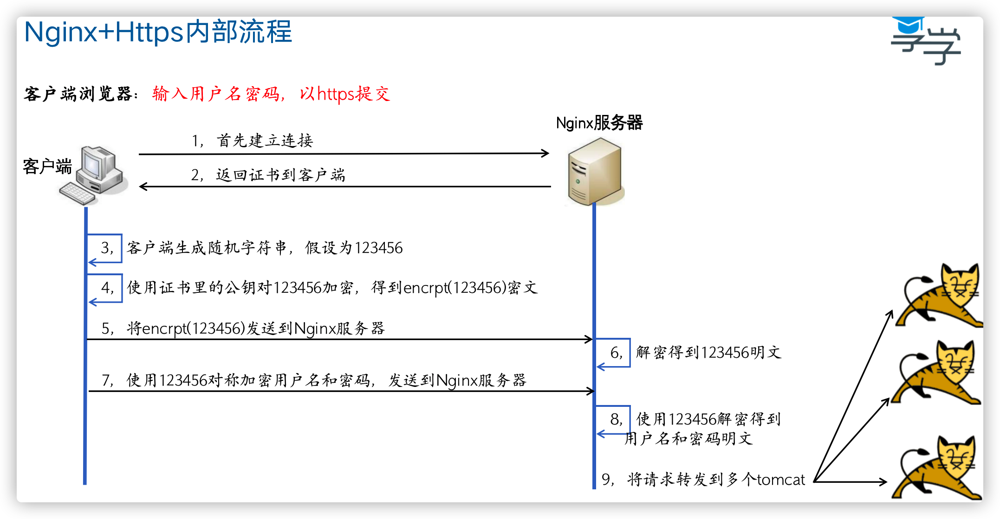

## nginx简介

**Apache**

Apache仍然是时长占用量最高的web服务器，据最新数据统计，市场占有率目前是50%左右。主要优势在于一个是比较早出现的一个Http静态资源服务器，同时又是开源的。所以在技术上的支持以及市面上的各种解决方案都比较成熟。Apache支持的模块非常丰富。

**Nginx**

Nginx是俄罗斯人编写的一款高性能的HTTP和反向代理服务器，在高连接并发的情况下，它能够支持高达50000个并发连接数的响应，但是内存、CPU等系统资源消耗却很低，运行很稳定。目前Nginx在国内很多大型企业都有应用，据最新统计，Nginx的市场占有率已经到33%左右了。而Apache的市场占有率虽然仍然是最高的，但是是呈下降趋势。而Nginx的势头很明显。选择Nginx的理由也很简单：第一，它可以支持5W高并发连接；第二，内存消耗少；第三，成本低，如果采用F5、NetScaler等硬件负载均衡设备的话，需要大几十万。而Nginx是开源的，可以免费使用并且能用于商业用途

## 架构中的作用

**介绍nginx在系统架构（网关入口）中的作用，总结如下：**

1、路由功能（与微服务对应）：域名/路径，进行路由选择后台服务器

2、负载功能（与高并发高可用对应）：对后台服务器集群进行负载

3、静态服务器（比tomcat性能高很多）：在mvvm模式中，充当文件读取职责

总结：实际使用中，这三项功用，会混合使用。比如先分离动静，再路由服务，再负载机器

## 正向代理和反向代理

正向代理：如开vpn，知道自己需要访问的网站是什么，通过vpn直接访问

反向代理：打开百度网址，可能有成百上千的服务器，但是用户只需要输入网址就可以访问，不需要关心后面有多少服务器

## nginx安装（未测试仅供参考，有条件的可以百度）

**源码编译方式：**

安装make：yum -y install autoconf automake make

安装g++: yum -y install gcc gcc-c++ 

\#一般系统中已经装了了make和g++，无须再装

  

yum -y install pcre pcre-devel  

yum -y install zlib zlib-devel

yum install -y openssl openssl-devel

\#安装nginx依赖的库

 

wget http://nginx.org/download/nginx-1.9.15.tar.gz

tar -zxvf nginx-1.9.0.tar.gz

cd nginx-1.9.0

./configure  --prefix=/usr/local/nginx --with-http_stub_status_module --with-http_ssl_module 

\#配置

\#--prefix指定安装目录

\#--with-http_ssl_module安装https模块

\#creating objs/Makefile 代表编译成功

make && make install 

\#make编译

\#make install安装

**yum方式：**

centos6：yum install epel-release -y  #yum扩展源

yum install nginx -y

**启停命令：**

./nginx -c nginx.conf的文件。如果不指定，默认为NGINX_HOME/conf/nginx.conf

./nginx -s stop 停止

./nginx -s quit退出

./nginx -s reload 重新加载nginx.conf

**发送信号的方式**

kill -QUIT 进程号 安全停止

kil -TERM 进程号 立即停止

## 目录结构

· Conf 配置文件

· Html  网页文件

· Logs  日志文件

· Sbin  二进制程序

## 防盗链

### 目的

1、让资源只能在我的页面内显示

2、不能单独来取或者下载

### 流程

1、chrome以url1首次请求web服务器，得到html页面。

2、chrome再次发起url2资源请求，携带referers = url1。（注意，是url1，不是本次的url2）

3、nginx校验referers值，决定是否允许访问。

## nginx+https

