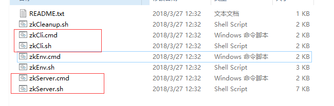
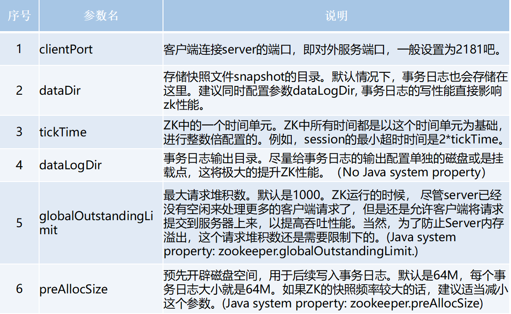
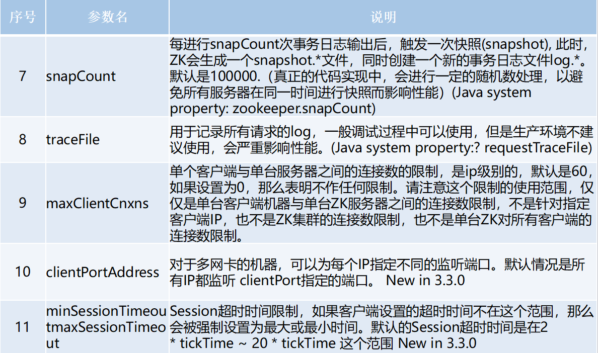
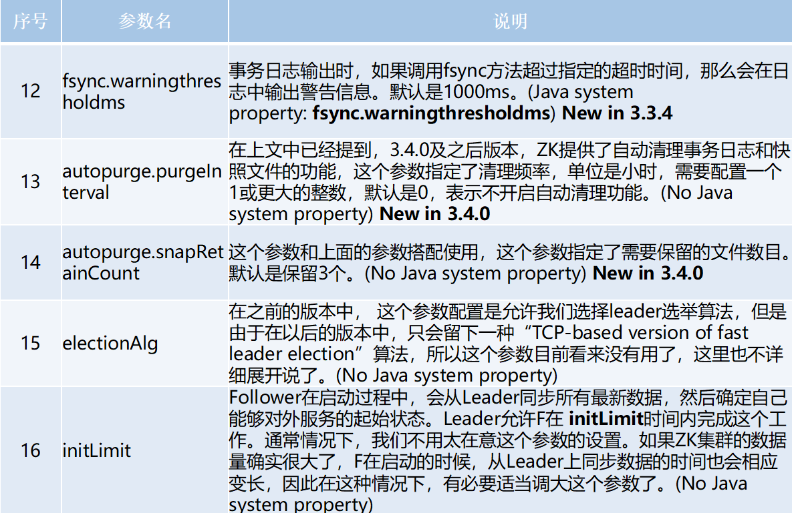
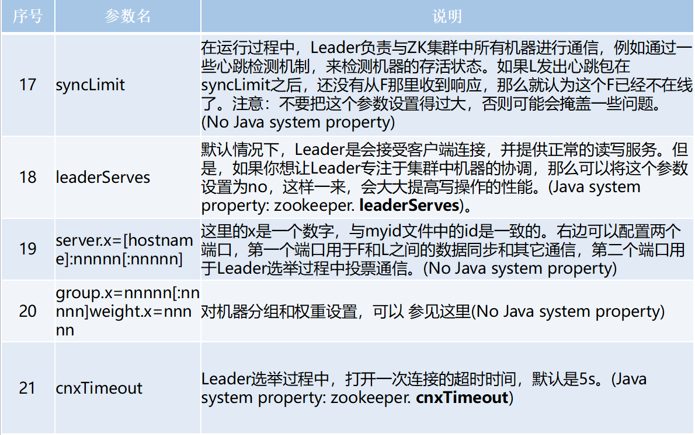
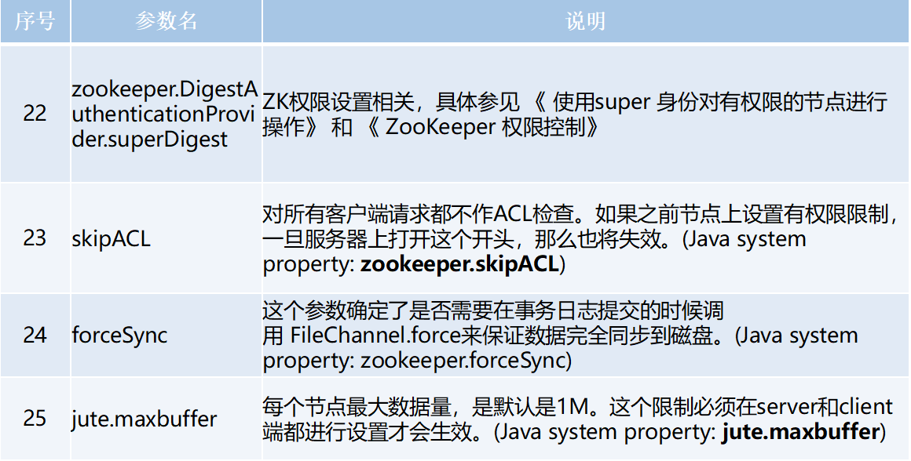
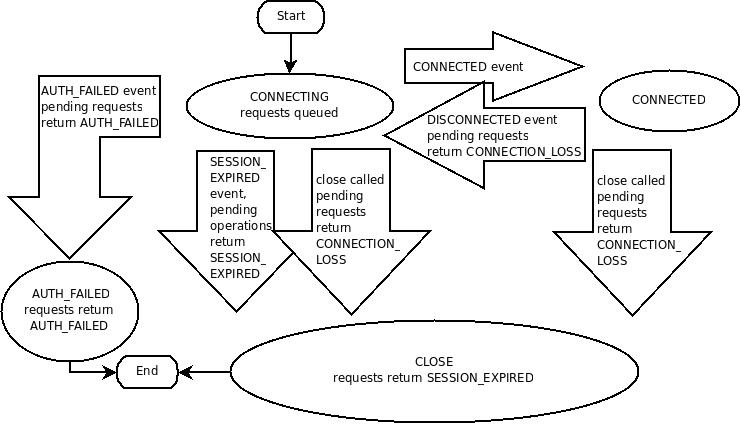
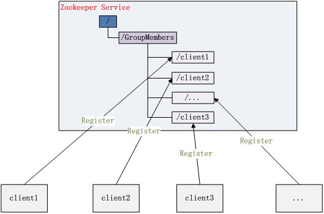
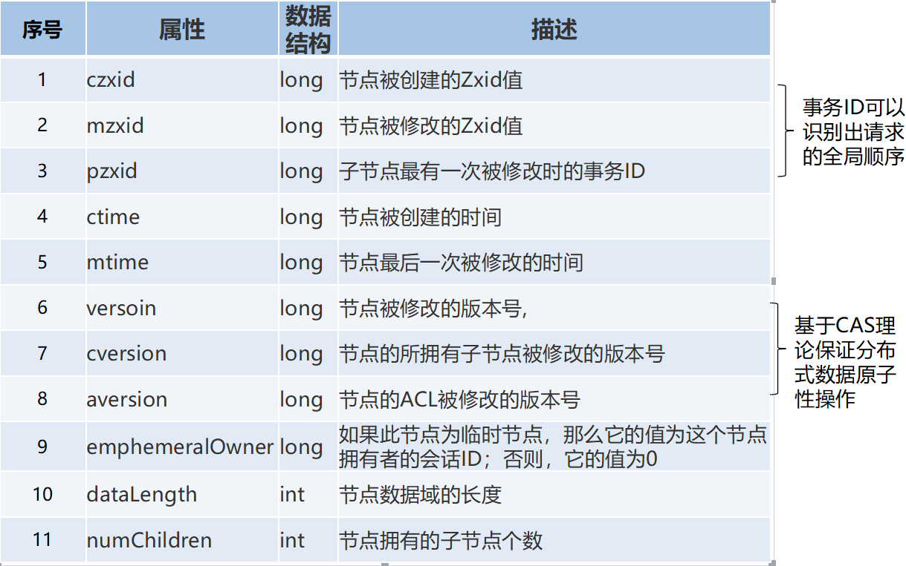

## 为什么学习zk（上文分布式系统）

  应该重点掌握分布式环境的演进过程，从一个单节点开始，慢慢过渡到分布式，为什么单节点不行，传统一个tomcat打天下有什么有点，缺点又是什么，当一个tomcat搞不定的时候，分布式的架构图又是什么样的，传统的单节点架构自然有问题，到了分布式的架构中，问题肯定也有不少，这些问题就是我们学习ZK要解决的，但学习这些解决方案之前，还是需要有点理论基础。接下来就要了解下什么是zk,为什么学习zk, Zk在分布式架构中扮演了什么样的角色。以及面试的时候经常会问到的问题，心里要有个大概的了解。

## zk简介

### 简介

​	ZooKeeper致力于提供一个高性能、高可用，且具备严格的顺序访问控制能力的分布式协调服务，是雅虎公司创建，是Google的Chubby一个开源的实现，也是Hadoop和Hbase的重要组件。

#### 设计目标

* 简单的数据结构：共享的树形结构，类似文件系统，存储于内存；

* 可以构建集群：避免单点故障，3-5台机器就可以组成集群，超过半数正常工作就能对外提供服务；

* 顺序访问：对于每个读请求，zk会分配一个全局唯一的递增编号，利用这个特性可以实现高级协调服务；

* 高性能：基于内存操作，服务于非事务请求，适用于读操作为主的业务场景。3台zk集群能达到13w QPS；

### 哪些常见需求用到zk

* 数据发布订阅

* 负载均衡

* 命名服务

* Master选举

* 集群管理

* 配置管理

* 分布式队列

* 分布式锁

  

### 部署

百度

#### 目录结构

bin       存放系统脚本
conf       存放配置文件
contrib      zk附加功能支持
dist-maven    maven仓库文件
docs       zk文档
lib        依赖的第三方库
recipes      经典场景样例代码
src       zk源码

其中bin和conf是非常重要的两个目录，平时也是经常使用的。

##### bin目录

其中
zkServer为服务器，启动后默认端口为2181
zkCli为命令行客户端

##### conf目录

Conf目录为配置文件存放的目录，zoo.cfg为核心的配置文件
这里面的配置很多，这配置是运维的工作，目前没必要，也没办法全部掌握。

在这挑选几个讲解：
clientPort：参数无默认值，必须配置，用于配置当前服务器对外的服务端口，客户端必须使用这端口才能进行连接
dataDir：用于存放内存数据库快照的文件夹，同时用于集群的myid文件也存在这个文件夹里（注意：一个配置文件只能包含一个dataDir字样，即使它被注释掉了。）
dataLogDir：用于单独设置transaction log的目录，transaction log分离可以避免和普通log还有快照的竞争
dataDir：新安装zk这文件夹里面是没有文件的，可以通过snapCount参数配置产生快照的时机

以下配置集群中才会使用
tickTime：心跳时间，为了确保连接存在的，以毫秒为单位，最小超时时间为两个心跳时间
initLimit：多少个心跳时间内，允许其他server连接并初始化数据，如果ZooKeeper管理的数据较大，则应相应增大这个值
syncLimit：多少个tickTime内，允许follower同步，如果follower落后太多，则会被丢弃。

#### zk特性

​	Zk的特性会从会话、数据节点，版本，Watcher，ACL权限控制，集群角色这些部分来了解，其中重点需要掌握的数据节点与Watcher

##### 会话

	客户端与服务端的一次会话连接，本质是TCP长连接，通过会话可以进行心跳检测和数据传输；
	会话（session）是zookepper非常重要的概念，客户端和服务端之间的任何交互操作都与会话有关
看下这图，Zk客户端和服务端成功连接后，就创建了一次会话，ZK会话在整个运行期间的生命周期中，会在不同的会话状态之间切换，这些状态包括：
	CONNECTING、CONNECTED、RECONNECTING、RECONNECTED、CLOSE
	一旦客户端开始创建Zookeeper对象，那么客户端状态就会变成CONNECTING状态，同时客户端开始尝试连接服务端，连接成功后，客户端状态变为CONNECTED，通常情况下，由于断网或其他原因，客户端与服务端之间会出现断开情况，一旦碰到这种情况，Zookeeper客户端会自动进行重连服务，同时客户端状态再次变成CONNCTING，直到重新连上服务端后，状态又变为CONNECTED，在通常情况下，客户端的状态总是介于CONNECTING和CONNECTED之间。但是，如果出现诸如会话超时、权限检查或是客户端主动退出程序等情况，客户端的状态就会直接变更为CLOSE状态

#### zk数据模型

​	ZooKeeper的视图结构和标准的Unix文件系统类似，其中每个节点称为“数据节点”或ZNode,每个znode可以存储数据，还可以挂载子节点，因此可以称之为“树”
​	第二点需要注意的是，每一个znode都必须有值，如果没有值，节点是不能创建成功的。

​	在Zookeeper中，znode是一个跟Unix文件系统路径相似的节点，可以往这个节点存储或获取数据
​	通过客户端可对znode进行增删改查的操作，还可以注册watcher监控znode的变化。

#### zk节点类型

节点类型非常重要，是后面项目实战的基础。
	a、Znode有两种类型：
		短暂（ephemeral）（create -e /app1/test1 “test1” 客户端断开连接zk删除ephemeral类型节点） 
		持久（persistent） （create -s /app1/test2 “test2” 客户端断开连接zk不删除persistent类型节点）

​	b、Znode有四种形式的目录节点（默认是persistent ）
​		PERSISTENT 
​		PERSISTENT_SEQUENTIAL（持久序列/test0000000019 ） 
​		EPHEMERAL 
​		EPHEMERAL_SEQUENTIAL

​	c、创建znode时设置顺序标识，znode名称后会附加一个值，顺序号是一个单调递增的计数器，由父节点维护 

​	d、在分布式系统中，顺序号可以被用于为所有的事件进行全局排序，这样客户端可以通过顺序号推断事件的顺序

#### zk节点状态属性

#### ACL保障数据的安全

​	ACL机制，表示为scheme: id:permissions，第一个字段表示采用哪一种机制，第二个id表示用户，permissions表示相关权限（如只读，读写，管理等）。
​	zookeeper提供了如下几种机制（scheme）：
​		**world:** 它下面只有一个id, 叫anyone, world:anyone代表任何人，zookeeper中对所有人有权限的结点就是属于world:anyone
​		**auth:** 它不需要id, 只要是通过authentication的user都有权限（zookeeper支持通过kerberos来进行authencation, 也支持username/password形式的authentication)

***\*digest:\**** 它对应的id为username:BASE64(SHA1(password))，它需要先通过username:password形式的authentication

***\*ip:\**** 它对应的id为客户机的IP地址，设置的时候可以设置一个ip段，比如ip:192.168.1.0/16, 表示匹配前16个bit的IP段

 

现在看这可能懵懵懂懂，不过没有关系，等会在客户端操作的时候会有详细的操作

